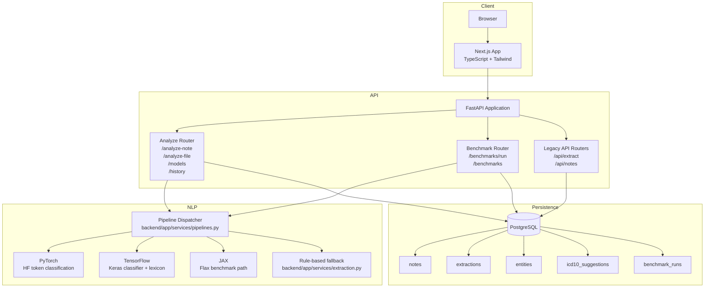
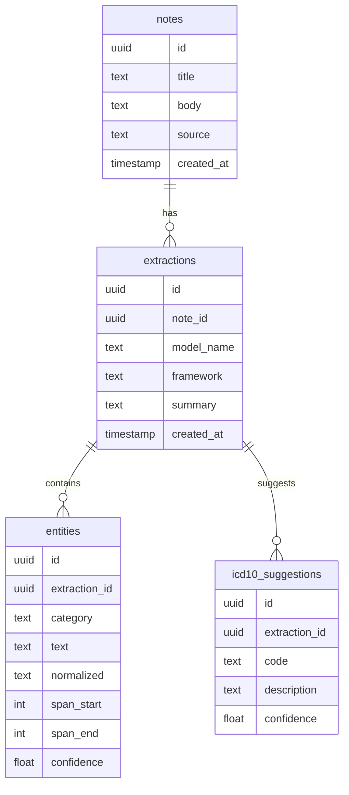

# MedExtract Architecture

MedExtract is organized as a full-stack clinical NLP demo with a typed frontend, a FastAPI service layer, PostgreSQL persistence, and swappable extraction pipelines.

## System Diagram

## Request Lifecycle

1. The user submits a fictional note through the Next.js frontend or directly through the API.
2. FastAPI validates the request with Pydantic schemas.
3. The analyze router calls the framework dispatcher with `pytorch`, `tensorflow`, or `jax`.
4. The dispatcher loads the requested pipeline when dependencies are available.
5. If the pipeline cannot load, MedExtract falls back to the rule-based extractor and reports the model as `placeholder`.
6. Results are normalized into the shared response schema:
   - conditions
   - symptoms
   - medications
   - procedures
   - ICD-10 suggestions
   - patient-friendly summary
   - confidence
7. The backend persists the note, extraction, entities, and ICD-10 suggestions to PostgreSQL.
8. The frontend renders grouped results and allows users to revisit history.

## Persistence Model

## Deployment Shape

Docker Compose starts:

| Service | Internal Port | Default Host Port | Purpose |
| --- | ---: | ---: | --- |
| `db` | `5432` | `5433` | PostgreSQL 16 |
| `backend` | `8000` | `8010` | FastAPI service |
| `frontend` | `3000` | `3100` | Next.js application |

The backend container is intentionally lightweight. Large ML dependencies can be installed for local experiments, while the fallback extractor keeps the demo runnable without GPU or model downloads.

## Safety Boundary

MedExtract is a synthetic-data research scaffold. It should be treated as a portfolio system that demonstrates architecture, API design, and NLP workflow patterns, not as deployable clinical software.
