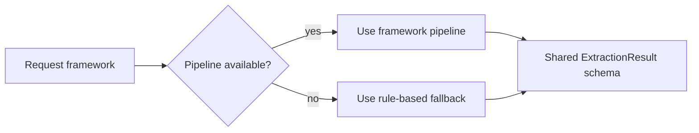

# MedExtract Model Comparison

MedExtract uses a shared API schema across multiple extraction paths so the frontend can compare frameworks without changing UI code.

## Comparison Table

| Framework | Implementation | Primary Task | Best Use | Strengths | Limitations |
| --- | --- | --- | --- | --- | --- |
| PyTorch | `ml/pytorch_pipeline/` | Token-classification NER | Span-level entity extraction demos | Uses Hugging Face token classification; can load a fine-tuned checkpoint; better suited to entity spans than pure lexicon matching | Requires optional ML dependencies; fresh clones may use pretrained fallback or rule-based fallback; ICD-10 suggestion remains heuristic |
| TensorFlow | `ml/tensorflow_pipeline/` | Note-category classification plus lexicon extraction | Lightweight model-assisted confidence comparisons | Keras training path; fast classifier; useful for comparing framework behavior | Extracted entities are limited to known lexicon terms; classifier does not create new spans |
| JAX | `ml/jax_pipeline/` | Flax research/benchmark classifier path | Multi-framework benchmarking and experimentation | Demonstrates JAX/Flax serving path; useful for latency and architecture comparison | Research-only path; shares assumptions with TensorFlow pipeline; not production-oriented |
| Rule-based fallback | `backend/app/services/extraction.py` | Dictionary entity extraction and heuristic ICD-10 suggestions | Always-on demo behavior and backend tests | No model download; no heavy dependencies; deterministic outputs | Limited vocabulary; weak generalization; no learned context, negation, or normalization |

## Serving Behavior

The backend routes requests through `backend/app/services/pipelines.py`.



`GET /models` reports whether each framework is currently serving an `available` pipeline or a `placeholder` fallback. This makes the demo transparent when optional ML dependencies or checkpoints are missing.

## Output Contract

All paths return:

- conditions
- symptoms
- medications
- procedures
- ICD-10 suggestions
- patient-friendly summary
- model name
- safety disclaimer

The `/analyze-note` and `/analyze-file` endpoints also compute an aggregate confidence score from entity and ICD-10 suggestion confidences.

## Known Modeling Limits

- Negation is not fully handled.
- ICD-10 output is suggestion logic, not a certified coding model.
- Synthetic templates can overstate model quality.
- Entity normalization is minimal and does not link to medical ontologies.
- Confidence values are useful for demos but are not calibrated probabilities.
- TensorFlow and JAX paths are classifier-assisted rather than full clinical NER systems.

## Training Notes

Optional framework dependencies live in each pipeline folder:

```bash
pip install -r ml/pytorch_pipeline/requirements.txt
pip install -r ml/tensorflow_pipeline/requirements.txt
pip install -r ml/jax_pipeline/requirements.txt
```

Example training entry points:

```bash
python -m pytorch_pipeline.train
python -m tensorflow_pipeline.train
python -m jax_pipeline.train
```

Generated checkpoints are intentionally gitignored. Keep large models out of the repository and document how to reproduce them.
